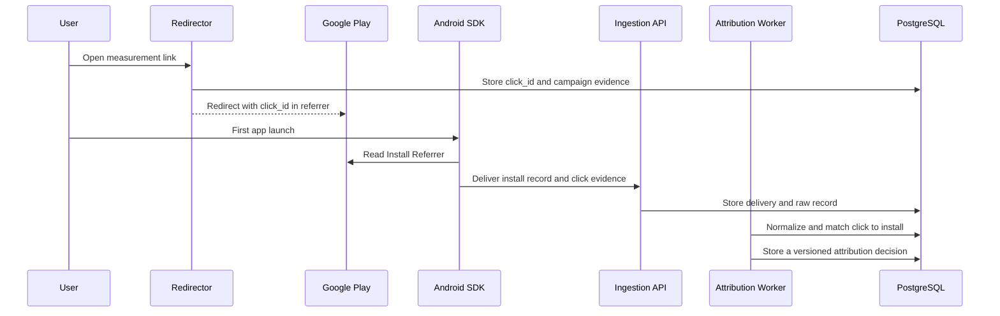

# Initial Architecture

## Approach

Start with a modular monolith and PostgreSQL. Do not add ClickHouse, Kafka, or service decomposition until measured load demonstrates the need.

Proposed stack:

- Server: TypeScript on Node.js
- Schemas: JSON Schema Draft 2020-12 with generated runtime types
- Database: PostgreSQL
- Android SDK: Kotlin
- Unity integration: C# API with an Android Kotlin bridge
- iOS SDK: Swift, Phase 2
- Dashboard: TypeScript web application, later in the MVP
- Local runtime: Docker Compose

## Android Phase 1 flow



## Components

### Redirector

- Accepts `GET /r/{slug}`
- Resolves an approved destination from the link configuration
- Generates and records a server-side `click_id`
- Adds an encoded referrer to the Google Play URL on Android
- Falls back to a safe configured destination without exposing internal errors

### Ingestion API

- Accepts `POST /v1/events/batch`
- Assigns the authoritative tenant and app from an authenticated SDK key or adapter configuration; client-supplied IDs are consistency checks only
- Validates payload size, event count, clock skew, and schema version
- Stores delivery, raw record, and logical event as separate concepts
- Distinguishes successful receipt from successful normalization or attribution

Minimal delivery example:

```json
{
  "sdk_version": "0.1.0",
  "app_id": "app_public_id",
  "events": [
    {
      "event_id": "uuid",
      "installation_id": "app_scoped_random_uuid",
      "event_name": "install",
      "occurred_at": "2026-08-11T00:00:00Z",
      "install_referrer": "openmmp_click_id=..."
    }
  ]
}
```

The contract Epic will replace this illustrative payload with canonical schemas. Until then, it is not a stable API.

### Attribution Core

Implement attribution as a pure evaluator. Recalculation must fix the inputs and all relevant policy versions:

- Raw-record watermark
- Immutable input snapshot ID or ledger position
- Attribution rule bundle
- Metric definition
- Time zone and window boundaries
- FX policy and rounding
- Output schema version

Initial Android rule:

1. Extract a verifiable `click_id` from Install Referrer evidence.
2. Confirm that the click belongs to the same tenant and app.
3. Confirm that the click precedes the install and falls inside the seven-day half-open window.
4. Return `non_organic` with a deterministic method and reason when valid.
5. Otherwise return `organic` or `unattributed` with an explicit reason code.

### Reporting API

- Separate raw-record access from aggregate reporting
- Require an explicit time zone for every period query
- Include attribution method, rule version, input watermark, and data freshness
- Include an immutable input snapshot ID or ledger position so equal timestamps cannot select different record sets
- Expose late-arrival and recalculation state
- Never present aggregate privacy reports as user-level records

## Data layers

Minimum logical entities:

- `tenants`
- `apps`
- `sdk_keys`
- `tracking_links`
- `clicks`
- `raw_records`
- `event_deliveries`
- `events`
- `corrections`
- `installations`
- `attributions`
- `fraud_decisions`
- `metric_runs`
- `privacy_requests`
- `audit_logs`

The layers have distinct responsibilities:

- `raw_records`: append-only received evidence and payload digest
- `event_deliveries`: retries, duplicate deliveries, and ID conflicts
- `events`: normalized logical events
- `corrections`: causal correction, retraction, and redaction records
- `attributions`: versioned and supersedable decisions
- `metric_runs`: aggregates with a fixed input watermark and policy versions

Do not compress independent concerns into one `data_quality_status`. Store ingestion, duplicate resolution, timeliness, record lifecycle, and attribution finality as separate axes.

## Attribution result minimum

- `attribution_id`
- `tenant_id`
- `app_id`
- `subject_scope`: `user_level | aggregate`
- `subject_ref`
- `status`: `organic | non_organic | unattributed`
- `method`
- `model`
- `reason_code` and registry version
- Evidence references with access classifications
- Input cutoff and decision timestamps
- Rule bundle ID, version, and digest
- `finality`
- `supersedes_attribution_id`

Aggregate subjects must not contain an `installation_id`.

## Later phases

- Existing MMP raw-export adapters and shadow reconciliation
- Apple AdAttributionKit and SKAdNetwork postback receipt and verification
- Android Attribution Reporting event-level and aggregatable reports
- Server-to-server events
- Role-based access control
- Analytical storage when PostgreSQL is no longer sufficient
- Media cost adapters

Privacy-preserving aggregate reports remain a dedicated aggregate series and are never forcibly joined to an installation.
